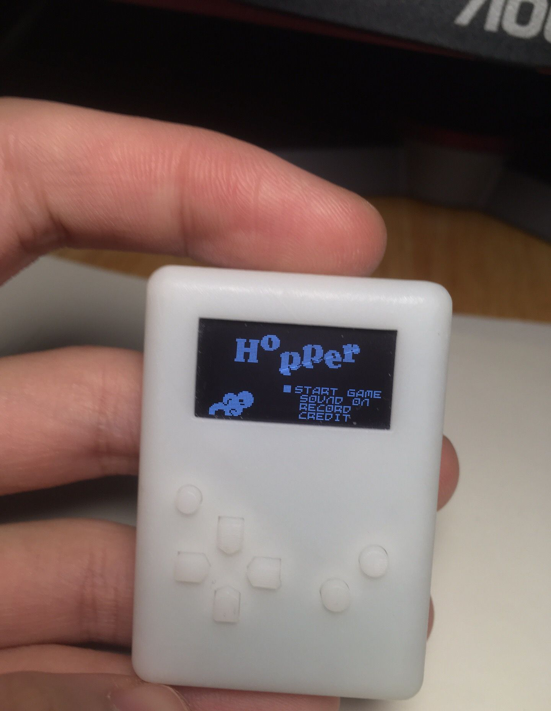
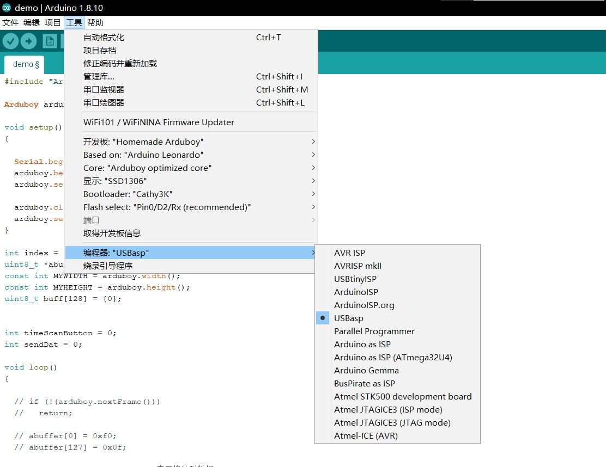

### Arduboy V3 版本

该版本加入了 SPI FLASH, 可存储几百个游戏。

* 文件说明
  * Gerber 用于PCB打样
  * 3D 文件用于打印外壳
  * 可按照BOM 表提供的链接购买元件

* 制造 (非广告)
  * 可选3D 打印厂家, [未来工厂](www.wenext.cn)
  * 可选PCB加工厂, [嘉立创](www.jlc.com)
  * [bootloader 烧录器](https://item.taobao.com/item.htm?spm=a1z10.3-c-s.w4002-21223910208.10.70e96a4bl0rGBP&id=583431925839)

* Bootloader
  bootloader 加入了在主界面下按 B 键关机, 这样就不再需要电源开关了。bootloader 可直接在 Arduino 中下载, 只需把 Leonardo 的 bootloader 换arduboy3k-bootloader, 然后执行烧录引导程序：
  