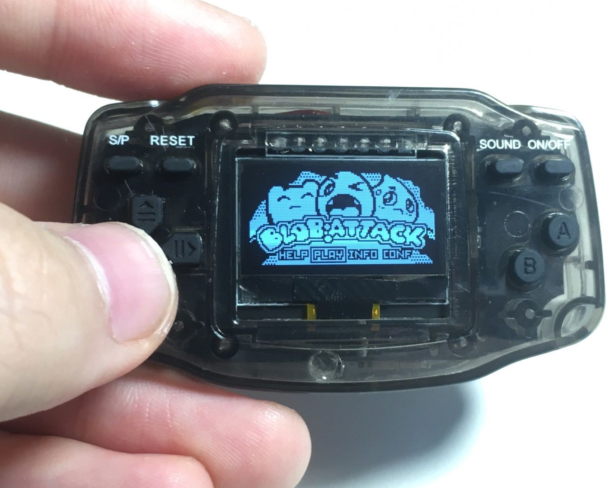

### Arduboy V4 版本
V4 版本分成两块板子, 一个是底板, 一个是 OLED, 外壳使用[现成的]模型改造而来(https://s.taobao.com/search?q=%E8%BF%B7%E4%BD%A0%E4%BF%84%E7%BD%97%E6%96%AF%E6%96%B9%E5%9D%97&type=p&tmhkh5=&from=sea_1_searchbutton&catId=100&spm=a2141.241046-cn.searchbar.d_2_searchbox)

* Bootloader 下载和配料清单参考 V3 版本. 因为只是外形改变, 功能和电路几乎一致. 
* 制作过程见[Bilibili](https://www.bilibili.com/video/BV1QK4y1H7EQ)
